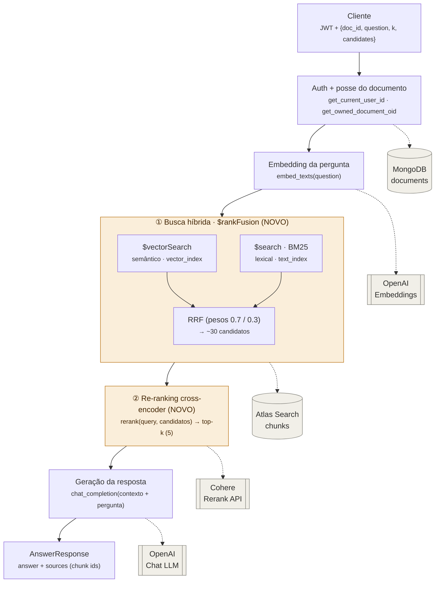

# Arquitetura RAG — Busca Híbrida + Re-ranking

> Documento de arquitetura do fluxo de recuperação do endpoint `POST /rag/ask`,
> após a introdução de **busca híbrida** (`$rankFusion`) e **re-ranking** por
> cross-encoder.

## Contexto

O serviço é um RAG sobre **FastAPI + MongoDB Atlas + cliente OpenAI-compatible**.
O endpoint `POST /rag/ask` responde perguntas com base apenas nos chunks de um
documento do próprio usuário.

O fluxo **original** era de fase única:

```
embedding da pergunta → $vectorSearch (top-5) → LLM
```

A busca puramente vetorial é forte em semântica (paráfrase, sinônimo), mas falha
em correspondência lexical exata — siglas, nomes próprios, códigos, números. O
novo fluxo resolve isso com uma estratégia de **recuperação em duas fases**
(*retrieve → re-rank*).

## Diagrama do fluxo



> Legenda: **amarelo** = recursos novos (híbrido + rerank); **cinza** = serviços externos.

## As duas fases

### Fase 1 — Recall amplo: Busca Híbrida (`$rankFusion`)

Roda **dois recuperadores em paralelo** dentro de um único pipeline de agregação
do Mongo e funde os rankings por **Reciprocal Rank Fusion (RRF)**:

| Recuperador | Operador | Índice | Captura |
|-------------|----------|--------|---------|
| Semântico | `$vectorSearch` | `vector_index` | paráfrase, sinônimo, intenção |
| Lexical (BM25) | `$search` | `text_index` | termos exatos, siglas, códigos, números |

A fusão usa o operador nativo **`$rankFusion`** (MongoDB Atlas **8.1+**), com pesos
configuráveis (padrão `vector=0.7`, `text=0.3`). Ambos os ramos filtram por
`document_id`, preservando o isolamento por documento/dono.

- **Objetivo:** maximizar **recall** — não deixar o trecho certo de fora.
- **Saída:** ~30 candidatos (parâmetro `candidates`).
- **Código:** [`app.rag.store.hybrid_search_chunks`](../app/rag/store.py).

### Fase 2 — Precisão: Re-ranking (cross-encoder)

Os ~30 candidatos passam por um **cross-encoder** (API de rerank, padrão Cohere)
que pontua cada chunk olhando **query + texto juntos** — bem mais preciso que a
similaridade de cosseno usada na recuperação. Reordena e devolve o **top-k** (5).

- **Objetivo:** maximizar **precision** — garantir que o que vai ao contexto do
  LLM é o mais relevante.
- **Saída:** top-k chunks com `rerank_score`.
- **Código:** [`app.rag.rerank.rerank`](../app/rag/rerank.py).

## Por que duas fases (retrieve → re-rank)

Um único recuperador tem que escolher entre recall e precisão. Separando em duas
fases, cada uma otimiza uma métrica:

```
recuperação barata e ampla (recall)  →  reordenação cara e precisa (precision)
        ~30 candidatos                          top-5 para o LLM
```

Recuperar 30 em vez de 5 é praticamente de graça no Mongo; o custo/latência novos
ficam **concentrados na chamada de rerank**. Por isso `candidates` e `k` são
parâmetros do request — permitem ajustar o trade-off recall × custo por chamada.

## Decisões de design

- **Degradação graciosa.** O rerank é uma camada *opcional*. Sem `RERANK_API_KEY`
  ou em falha de rede/API, `rerank()` devolve os candidatos do híbrido na ordem
  original. O endpoint nunca quebra por causa de um serviço externo — e o híbrido
  sozinho já é uma melhoria sobre o vetor puro.
- **Dois índices, um filtro.** O híbrido exige **dois** índices Atlas na coleção
  `chunks` (`vector_index` + `text_index`); ambos os ramos filtram por `document_id`.
- **Acoplamento de versão.** `$rankFusion` é nativo do **Atlas 8.1+**. Para
  remover esse acoplamento, a alternativa é fazer RRF na aplicação (duas queries +
  fusão em Python) — portável a qualquer Mongo, ao custo de duas idas ao banco.
- **Sem novas dependências pesadas.** O rerank usa `httpx` (já presente); nenhum
  SDK ou modelo local é necessário no caminho padrão.

## Configuração

### Índice de texto (Atlas Search) — necessário para o BM25

Além do `vector_index`, crie `text_index` na coleção `chunks`:

```js
use curso_api
db.runCommand({
  createSearchIndexes: "chunks",
  indexes: [
    {
      name: "text_index",
      definition: {
        mappings: {
          dynamic: false,
          fields: {
            chunk: { type: "string" },
            document_id: { type: "objectId" }
          }
        }
      }
    }
  ]
})
```

### Variáveis de ambiente do rerank

| Variável | Padrão | Descrição |
|----------|--------|-----------|
| `RERANK_API_KEY` | — | Chave da API de rerank. **Ausente → rerank desativado** (no-op). |
| `RERANK_BASE_URL` | `https://api.cohere.com` | Endpoint base. Trocável por Jina/Voyage (mesmo formato `/v2/rerank`). |
| `RERANK_MODEL` | `rerank-v3.5` | Modelo de rerank. |

### Parâmetros do `/rag/ask`

| Parâmetro | Padrão | Descrição |
|-----------|--------|-----------|
| `candidates` | 30 | Recuperados na busca híbrida (antes do rerank). |
| `k` | 5 | Chunks finais (após rerank) usados no contexto do LLM. |

## Componentes

| Componente | Arquivo | Responsabilidade |
|------------|---------|------------------|
| Rota `/rag/ask` | [`app/api/v1/rag.py`](../app/api/v1/rag.py) | Orquestra: auth → embed → híbrido → rerank → LLM |
| Busca híbrida | [`app/rag/store.py`](../app/rag/store.py) | `hybrid_search_chunks` via `$rankFusion` |
| Re-ranking | [`app/rag/rerank.py`](../app/rag/rerank.py) | `rerank` via API cross-encoder + fallback |
| Cliente LLM/embeddings | [`app/llm/openai_client.py`](../app/llm/openai_client.py) | `embed_texts`, `chat_completion` |
