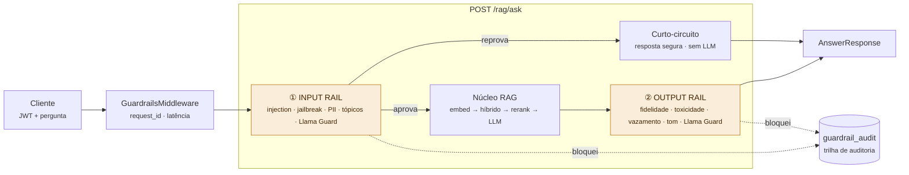

# Guardrails — Filtro de Segurança como Middleware

> Camada de segurança que envolve o núcleo RAG e intercepta a requisição em dois
> momentos: **input rail** antes do LLM/Ollama e **output rail** depois, com
> **trilha de auditoria** em cada bloqueio. Implementa a seção 3.3 da arquitetura.

## Princípio

Nada chega ao Ollama sem passar pela validação de entrada, e nada chega ao
usuário sem passar pela validação de saída. As checagens **baratas** (regex/
heurística) rodam de forma síncrona em threadpool; as **caras** (Llama Guard via
Ollama) rodam de forma assíncrona e, na saída, por amostragem — mantendo a
latência dentro do SLA. Empilhar técnicas é proposital: nenhuma isolada basta.

## Ciclo de vida da requisição (Figura 2)

## Input rail (antes do Ollama) — `apply_input_rail`

| Checagem | Detector | Ação |
|----------|----------|------|
| Prompt injection | regex (`patterns.PROMPT_INJECTION`) | **bloqueia** (curto-circuito) |
| Jailbreak | regex (`patterns.JAILBREAK`) | **bloqueia** |
| Tópicos proibidos | regex + `GUARDRAILS_BANNED_TOPICS` | **bloqueia** |
| PII | regex (`pii.detect_pii`) | **anonimiza** (padrão) ou bloqueia |
| Classificador | Llama Guard 3 via Ollama | **bloqueia** se `unsafe` |

Ao reprovar, devolve a `SAFE_INPUT_RESPONSE` **sem nunca acionar o LLM** —
economizando inferência e evitando risco.

## Output rail (depois do Ollama) — `apply_output_rail`

| Checagem | Detector | Ação |
|----------|----------|------|
| Fidelidade ao contexto (anti-alucinação) | heurística de sobreposição | **substitui** por resposta segura |
| Toxicidade | regex (`patterns.TOXICITY`) | **substitui** |
| Vazamento de PII/segredos | regex (`pii`, inclui chaves/tokens) | **redige** no lugar |
| Tom de voz corporativo | `GUARDRAILS_TONE_BANNED_PHRASES` | sinaliza (configurável) |
| Classificador | Llama Guard 3 via Ollama (amostrado) | **substitui** se `unsafe` |

## Por que a aplicação fica no endpoint (e não no middleware)?

`GuardrailsMiddleware` provê o **envelope transversal** (request_id de correlação
e latência) sem reescrever endpoints. Mas a aplicação de conteúdo das rails vive
dentro de `/rag/ask` por uma razão concreta: o output rail de **fidelidade**
precisa dos trechos recuperados (o contexto), que só existem no meio do fluxo do
endpoint — um middleware puro não tem acesso a eles. Assim, o middleware costura a
auditoria por `request_id`, e as rails interceptam o conteúdo onde o contexto está
disponível. O núcleo das rails (`app/guardrails/rails.py` e detectores) é
desacoplado do FastAPI e testável isoladamente (ver `tests/test_guardrails.py`).

## Trilha de auditoria (compliance)

Cada bloqueio/anonimização/reescrita é registrado em log estruturado e,
opcionalmente, na coleção MongoDB `guardrail_audit` — criando uma trilha
monitorável, fundamental sob regimes como o **EU AI Act**. Por design, a trilha
guarda apenas rótulos, severidades e contagens das violações — **nunca** o texto
cru que disparou a regra, para não virar um repositório de PII.

## Componentes

| Arquivo | Responsabilidade |
|---------|------------------|
| [`app/guardrails/rails.py`](../app/guardrails/rails.py) | Orquestra input/output rail |
| [`app/guardrails/detectors.py`](../app/guardrails/detectors.py) | Checagens baratas (injection, jailbreak, toxicidade, tom, fidelidade) |
| [`app/guardrails/patterns.py`](../app/guardrails/patterns.py) | Bancos de regex |
| [`app/guardrails/pii.py`](../app/guardrails/pii.py) | Detecção/anonimização de PII e segredos |
| [`app/guardrails/llama_guard.py`](../app/guardrails/llama_guard.py) | Llama Guard 3 via Ollama (httpx, async) |
| [`app/guardrails/audit.py`](../app/guardrails/audit.py) | Trilha de auditoria (log + Mongo) |
| [`app/guardrails/middleware.py`](../app/guardrails/middleware.py) | Envelope de correlação/latência |
| [`app/guardrails/config.py`](../app/guardrails/config.py) | Configuração via ambiente |

## Configuração (variáveis de ambiente)

| Variável | Padrão | Descrição |
|----------|--------|-----------|
| `GUARDRAILS_ENABLED` | `true` | Liga/desliga toda a camada. |
| `GUARDRAILS_FAIL_OPEN` | `true` | Em falha de um guard, permite seguir. |
| `GUARDRAILS_AUDIT_TO_MONGO` | `true` | Persiste a trilha no Mongo. |
| `GUARDRAILS_AUDIT_COLLECTION` | `guardrail_audit` | Coleção da trilha. |
| `GUARDRAILS_INPUT_PII_ACTION` | `anonymize` | `anonymize` ou `block`. |
| `GUARDRAILS_BANNED_TOPICS` | — | Termos extras (separados por vírgula). |
| `GUARDRAILS_FAITHFULNESS_MIN_OVERLAP` | `0.18` | Limiar do heurístico anti-alucinação. |
| `GUARDRAILS_OUTPUT_SAMPLE_RATE` | `1.0` | Amostragem das checagens caras de saída. |
| `GUARDRAILS_TONE_BANNED_PHRASES` | — | Frases banidas de tom (vazio = no-op). |
| `GUARDRAILS_LLM_ENABLED` | `false` | Liga o classificador Llama Guard. |
| `GUARDRAILS_OLLAMA_BASE_URL` | `http://localhost:11434` | Base do Ollama. |
| `GUARDRAILS_LLAMA_GUARD_MODEL` | `llama-guard3` | Modelo do guard. |
| `GUARDRAILS_LLM_TIMEOUT` | `20` | Timeout (s) das chamadas ao guard. |

> **Degradação graciosa.** Com `GUARDRAILS_LLM_ENABLED=false` (padrão) ou se o
> Ollama estiver indisponível, apenas as checagens baratas atuam e o endpoint
> nunca quebra — o mesmo princípio do rerank.

## Extensões previstas (camadas complementares)

- **NeMo Guardrails (Colang)** para regras de fluxo/tom mais ricas, compondo com o
  Llama Guard em vez de competir.
- **LLM Guard** como linha barata adicional de scanners.
- Reescrita de resposta não-fundamentada (em vez de substituição) via um segundo
  passe do LLM, quando o custo couber no SLA.
